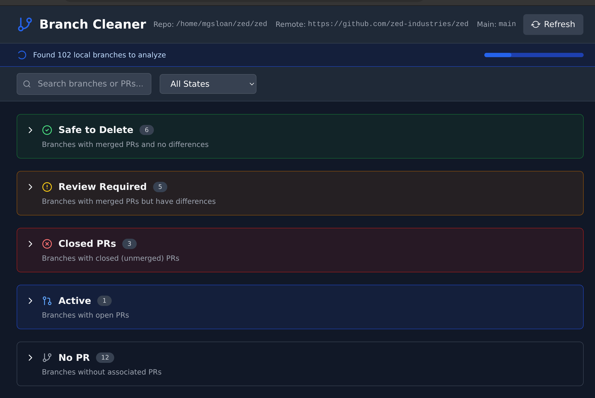

# Local Branch Cleaner (based on GitHub PRs)

The purpose of this utility is to safely delete local git branches, by looking at associated PRs in GitHub. I use fuzzy text search when switching branches and to keep track of work-in-progress changes, so it's nice to have a way to keep the list tidy.

This also helps with the case where you've forgotten to push to a PR or merged a PR without first pushing. It will detect when the merged PR has a mismatch with your local branch and provide a diff of the diffs.

This was 100% vibecoded using Zed Agent + Claude Opus 4. I literally made no code changes myself. I've barely looked at the code, but it seems to work well - use at your own risk! Known rough corners:

* Probably only works when pushing branches to the same repo

* Only known to work for squash-and-rebased PRs.  Good chances it works for PRs merged with merge commits.  Probably does not work for PRs that are merged via rebase

Run `path-to-this-repo/start.sh` from within a git repository that has a GitHub remote URL to start the server and automatically open in your browser.

## Prerequisites

(Not sure if these are accurate, this is just what the model listed)

- Python 3.8+
- Node.js 16+
- Git
- [GitHub CLI (`gh`)](https://cli.github.com/) - authenticated with your GitHub account

## Screenshots

